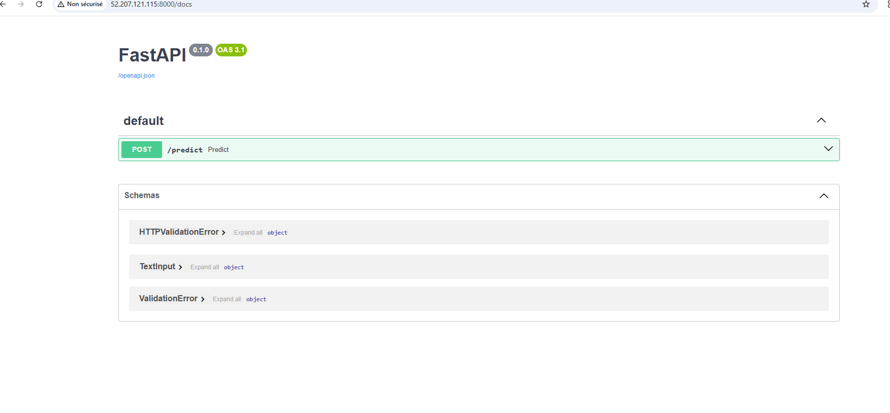
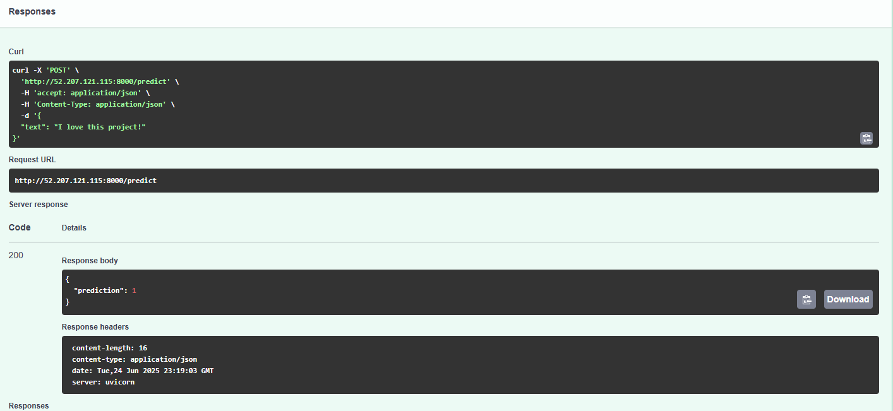

# 📦 Projet MLOps – Déploiement Sentiment Analysis

## 🚀 Projet DevOps/MLOps - DATAIA  
**Auteurs :** Souissi & Bouchareb  
**Sujet :** Déploiement d’un modèle d’analyse de sentiments en MLOps sur AWS

---

## 1️⃣ Objectif

- **Entraîner et tracker un modèle de Machine Learning (sentiment analysis).**
- **Containeriser l’API de prédiction (FastAPI + Docker).**
- **Automatiser le déploiement sur AWS (Terraform, Ansible, EC2).**
- **Assurer la reproductibilité complète pour l’évaluateur.**

---

## 2️⃣ Stack Technique

| Outil        | Usage                                    |
| ------------ | ---------------------------------------- |
| Python       | Data science, entraînement du modèle      |
| scikit-learn | Modélisation NLP, Logistic Regression     |
| MLflow       | Tracking & gestion des modèles            |
| Docker       | Containerisation de l’API                 |
| FastAPI      | API REST de prédiction                    |
| AWS EC2      | Hébergement du service                    |
| Terraform    | Provisioning de l’infra cloud (IaaC)      |
| Ansible      | Déploiement automatisé (IaC)              |

---

## 3️⃣ Structure du Répertoire

mlops-projet/
│
├── api.py # API FastAPI
├── train.py # Script d'entraînement + MLflow
├── IMDB Dataset.csv # Dataset
├── Dockerfile # Build image API
├── requirements.txt # Dépendances Python
├── exported_model/ # Modèle exporté (si besoin)
├── mlruns/ # Dossier MLflow runs
│
├── infra/
│ ├── terraform/
│ │ ├── main.tf, provider.tf, instances.tf, variables.tf
│ ├── ansible/
│ │ ├── playbook.yml, hosts.ini
│
└── README.md

---

## 4️⃣ Utilisation

### 🔹 A. Entraînement & tracking local

1. Installer les dépendances :
   pip install -r requirements.txt

2. Lancer l'entraînement et le tracking :
    python train.py

    Le modèle est tracké avec MLflow.

### 🔹  B. Build et test de l’API en local

1. Build l’image Docker :
    docker build -t sentiment-api .

2. Lancer l’API :
    docker run -d --name sentiment-api -p 8000:8000 sentiment-api

3. Tester la doc interactive sur http://localhost:8000/docs

### 🔹 C. Déploiement Cloud

1. Provisioning de l’infra (AWS EC2)
Dans infra/terraform :
    tofu init
    tofu apply
Note l’IP publique générée.

2. Déploiement automatisé avec Ansible
Dans infra/ansible :
Mets à jour hosts.ini avec l’IP publique et le chemin vers ta clé .pem
    Lance :
    ansible-playbook -i hosts.ini playbook.yml
(Si besoin, donne les droits 600 à ta clé PEM : chmod 600 chemin/vers/ta.pem)

3. Accès à l’API
    Va sur :
    http://<ip-aws>:8000/docs

Teste une prédiction via /predict

## 5️⃣ Captures d’écran

### 1. Documentation automatique FastAPI

### 2. Exemple de prédiction

### 3. Déploiement Ansible réussi

## 6️⃣ Notes importantes : 
Aucun fichier sensible ni trop volumineux dans le repo (pas de venv, .pem, .terraform, ni gros CSV)

